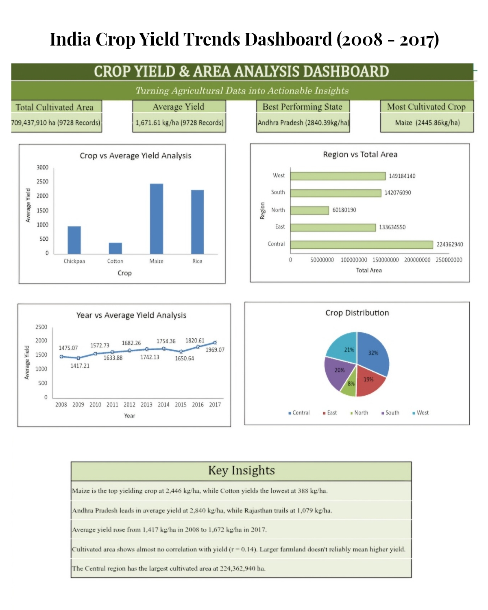

# India Crop Yield Trends Dashboard
Excel-based dashboard analyzing a 9,728-record historical crop yield dataset (2008–2017) across 20 Indian states and 311 districts. Includes data cleaning, outlier correction, correlation analysis, PivotTables, and an interactive dashboard with formula-driven KPI cards benchmarking yield, area, and regional trends.

## Highlights
- Built a 5-sheet workbook: Raw Data, Cleaned Data, Data Analysis, Pivot Tables, and an interactive Dashboard
- Correlation analysis (r = 0.14) showed cultivated area has minimal impact on yield, with crop type and region mattering more
- Identified and corrected a data quality outlier in the Maize records
- Average yield benchmarked at 1,672 kg/ha; Andhra Pradesh led at 2,840 kg/ha, Maize was the highest-yielding crop (2,446 kg/ha)

## Tools
MS Excel, PivotTables, correlation analysis, formula-driven KPI cards, dashboard design

## File
[Indian_Crop_Yield_Analytics.xlsx](Indian_Crop_Yield_Analytics.xlsx)
